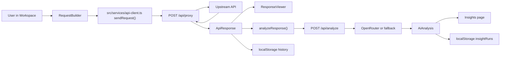

**Architecture Canvas**

**Frontend Main Files**
- [main.tsx](/Users/agasya/Downloads/api-insight-studio-main/src/main.tsx): React app bootstrap, mounts `<App />`.
- [App.tsx](/Users/agasya/Downloads/api-insight-studio-main/src/App.tsx): Global providers (React Query, tooltip, toasts), router setup for `/`, `/insights`, `*`.
- [pages/Index.tsx](/Users/agasya/Downloads/api-insight-studio-main/src/pages/Index.tsx): Main dashboard orchestration. Handles send request, analyze response, store run history, restore old runs, delete single run, clear all.
- [pages/Insights.tsx](/Users/agasya/Downloads/api-insight-studio-main/src/pages/Insights.tsx): Reads stored insight runs, lets user open one run, renders design/security/suggestions, per-run delete.
- [components/Header.tsx](/Users/agasya/Downloads/api-insight-studio-main/src/components/Header.tsx): Top nav + runtime badge (`LIVE BACKEND` vs `MOCK PREVIEW`) from API runtime config.
- [components/WorkspaceSidebar.tsx](/Users/agasya/Downloads/api-insight-studio-main/src/components/WorkspaceSidebar.tsx): Recent run list, run stats, per-run select/delete, clear-history button.
- [components/RequestBuilder.tsx](/Users/agasya/Downloads/api-insight-studio-main/src/components/RequestBuilder.tsx): Request form (method/url/headers/body/auth). Accepts `presetRequest` so past runs can reopen in composer.
- [components/ResponseViewer.tsx](/Users/agasya/Downloads/api-insight-studio-main/src/components/ResponseViewer.tsx): Response status/time, searchable body tree, headers tab, copy-to-clipboard.
- [components/JsonTree.tsx](/Users/agasya/Downloads/api-insight-studio-main/src/components/JsonTree.tsx): Recursive JSON renderer with collapsible object/array nodes.
- [services/api-client.ts](/Users/agasya/Downloads/api-insight-studio-main/src/services/api-client.ts): Core frontend API layer. Resolves base URL, supports mock mode, calls `/api/proxy` and `/api/analyze`, normalizes errors.
- [services/api.ts](/Users/agasya/Downloads/api-insight-studio-main/src/services/api.ts): Re-export wrapper for api-client.
- [services/workspace-store.ts](/Users/agasya/Downloads/api-insight-studio-main/src/services/workspace-store.ts): Local storage keys and shared run/insight types.
- [services/mock-data.ts](/Users/agasya/Downloads/api-insight-studio-main/src/services/mock-data.ts): Preview fallback response/analysis when backend isn’t configured.
- [hooks/use-persistent-state.ts](/Users/agasya/Downloads/api-insight-studio-main/src/hooks/use-persistent-state.ts): `useState` + localStorage sync.
- [hooks/use-backend-health.ts](/Users/agasya/Downloads/api-insight-studio-main/src/hooks/use-backend-health.ts): Health probe helper (currently optional to wire into UI).
- [types/api.ts](/Users/agasya/Downloads/api-insight-studio-main/src/types/api.ts): All request/response/analysis TypeScript contracts.
- [index.css](/Users/agasya/Downloads/api-insight-studio-main/src/index.css): Design tokens, light SaaS theme, utility classes (`surface`, `surface-soft`).

**Backend Main Files**
- [server/src/index.ts](/Users/agasya/Downloads/api-insight-studio-main/server/src/index.ts): Express app setup. CORS, JSON limit, logging, optional `helmet`/rate-limit, routes mount, health/root endpoints, error handlers.
- [server/src/config/env.ts](/Users/agasya/Downloads/api-insight-studio-main/server/src/config/env.ts): Environment validation with Zod (`PORT`, `CORS_ORIGIN`, `OPENROUTER_API_KEY`, rate-limit values).
- [server/src/routes/proxy.ts](/Users/agasya/Downloads/api-insight-studio-main/server/src/routes/proxy.ts): `/api/proxy`. Validates payload, SSRF checks, forwards with axios, timeout/body limits, returns `{status,responseTime,data,headers}`.
- [server/src/routes/analyze.ts](/Users/agasya/Downloads/api-insight-studio-main/server/src/routes/analyze.ts): `/api/analyze`. Validates input, calls OpenRouter utility, maps output into frontend `AiAnalysis` shape.
- [server/src/utils/ssrf.ts](/Users/agasya/Downloads/api-insight-studio-main/server/src/utils/ssrf.ts): Blocks localhost/private/internal IPs, resolves DNS, rejects internal DNS targets.
- [server/src/utils/openrouter.ts](/Users/agasya/Downloads/api-insight-studio-main/server/src/utils/openrouter.ts): Calls OpenRouter `openai/gpt-4o-mini`, enforces strict JSON schema parse, safe fallback on any failure.
- [server/src/middleware/validate.ts](/Users/agasya/Downloads/api-insight-studio-main/server/src/middleware/validate.ts): Generic Zod body validator middleware.
- [server/src/middleware/request-logger.ts](/Users/agasya/Downloads/api-insight-studio-main/server/src/middleware/request-logger.ts): Structured JSON request logs with latency.
- [server/src/middleware/error-handler.ts](/Users/agasya/Downloads/api-insight-studio-main/server/src/middleware/error-handler.ts): Central error formatting `{ error: { message, code } }`.
- [server/src/utils/errors.ts](/Users/agasya/Downloads/api-insight-studio-main/server/src/utils/errors.ts): `AppError` type for controlled status/code propagation.

**Files You Usually Don’t Need to Touch**
- `/src/components/ui/*`: reusable shadcn UI primitives.
- [NotFound.tsx](/Users/agasya/Downloads/api-insight-studio-main/src/pages/NotFound.tsx): fallback route page.
- [App.css](/Users/agasya/Downloads/api-insight-studio-main/src/App.css): minimal root sizing.

